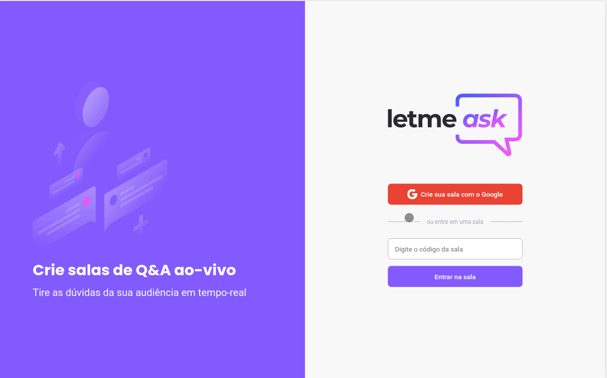
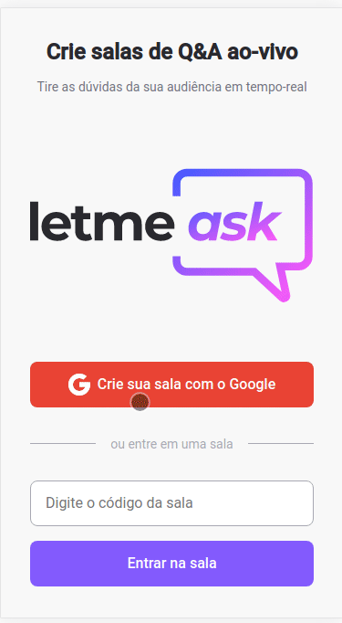

<h1 align="center">
    
</h1>

<p align="center">
 <a href="#📷-demonstração">Demonstração</a> •
 <a href="#ℹ️-sobre">Sobre</a> • 
 <a href="#🛠-tecnologias">Tecnologias</a> • 
 <a href="#🔗-link-do-projeto">Link do projeto</a> • 
 <a href="#🚀-como-executar">Como executar</a> •
 <a href="#📚-aprendizados">Aprendizados</a> • 
 <a href="#👨‍💻-autor">Autor</a> • 
 <a href="#👏-Agradecimentos">Agradecimentos</a> 
</p>

<p align="center">
  <a href="https://www.linkedin.com/in/rodrigovitoriense/">

</a>

</p><br>

# 📷 Demonstração




<br>

# ℹ️ Sobre

<p>
O projeto Letmeask foi realizado durante o evento Next Level Week Together. O objetivo da plataforma criada é resolver problemas de acúmulos de perguntas durante uma live, transmissão, etc. 
A plataforma nos permite criar salas privadas para que os participantes possam fazer perguntas (desde que estejam logados com uma conta do Google) e  votar em quais devem ser respondidadas pelo dono da sala. Já o dono da sala pode selecionar as perguntas, colocar foco, dentre outras funcionalidades.
</p>
  <br>

# 🛠 Tecnologias

As seguintes tecnologias foram utilizadas na construção do projeto:

- [ReactJS](https://reactjs.org/)
- [Firebase](https://firebase.google.com/)
- [TypeScript](https://www.typescriptlang.org/)
- [Styled Components](https://styled-components.com/)
  <br><br>

# 🔗 Link do projeto

- Link de demonstração do projeto: [Letmeask-rodrigorvix](https://letmeask-rodrigorvix.web.app/)
  <br>

# 🚀 Como executar

Clone o projeto e acesse a pasta.

```
$ git clone https://github.com/rodrigorvix/letmeask.git
$ cd letmeask
```
Crie um arquivo .env.local na raiz do projeto e adicione as suas configurações do firebase. 

```
# FIREBASE
REACT_APP_API_KEY="xxxxxxxxxxxxx"
REACT_APP_AUTH_DOMAIN="xxxxxxxxxxxxx"
REACT_APP_DATABASE_URL="xxxxxxxxxxxxx"
REACT_APP_PROJECT_ID="xxxxxxxxxxxxx"
REACT_APP_STORAGE_BUCKET="xxxxxxxxxxxxx"
REACT_APP_MESSAGE_SENDER_ID="xxxxxxxxxxxxx"
REACT_APP_APP_ID="xxxxxxxxxxxxx"
```
Siga os passos abaixo:

```
# Install the dependencies
$ yarn ou npm

# Start the project
$ yarn start
```

O aplicativo estará disponível para acesso pelo seu navegador em http://localhost:3000
 <br>

# 📚 Aprendizados
 
  Durante a construção do projeto foram apresentados diversos conceitos das tecnologias React, Firebase e TypeScript.
  Com isso, os principais aprendizados foram: 

 ## React:
    - conceitos e uso de componentes, propriedades e estados;
    - Hooks;
    - Contextos;
    - Rotas.

 ## Firebase:
    - Autenticação;
    - Uso do Realtime database. 

 ## TypeScript:
    - Tipagem de variáveis;
    - Melhoria na descoberta de falhas e bugs.
  
 ## Melhorias aplicadas no projeto:
    - Uso de style components (inicialmente foi utilizado o pré-processador SASS);
    - Responsividade.
  <br>
  
# 👨‍💻 Autor

- [Linkedin](https://www.linkedin.com/in/rodrigovitoriense/)
- [GitHub](https://github.com/rodrigorvix)
  <br>

# 👏 Agradecimentos

  Agradeço à Rocketseat pelo grande evento e por propagar tanto conhecimento a comunidade developer. 

